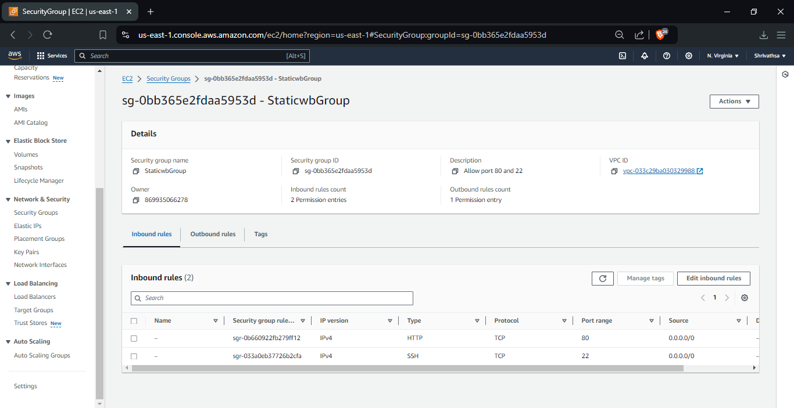
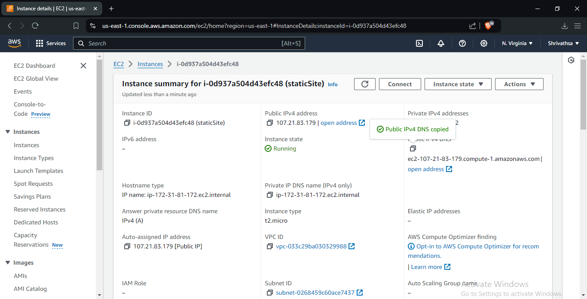
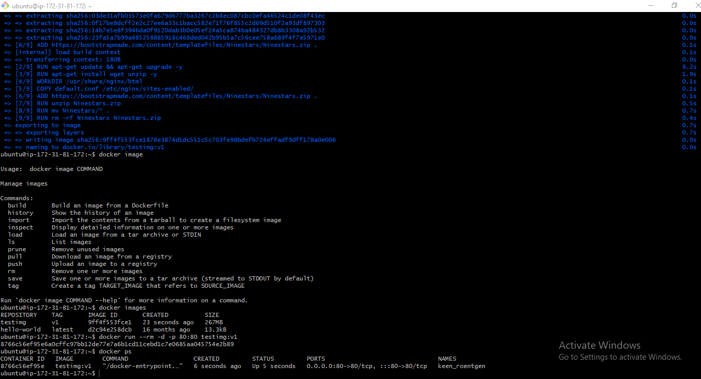
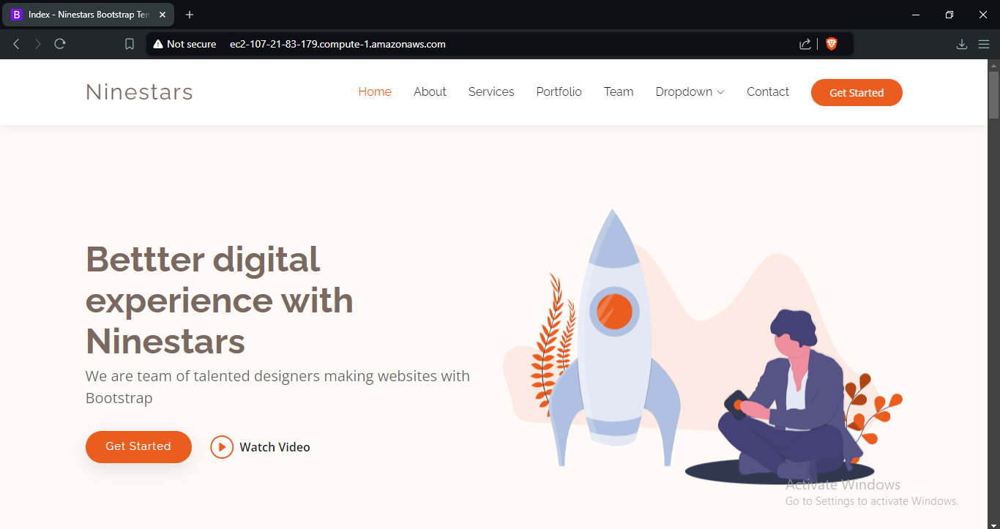

## Hosting Static Website on AWS EC2 Instance with Docker Container

Successfully completed this project that involves hosting a static website on an AWS EC2 instance using Docker. Below are the steps and screenshots documenting the process.

### Steps

1. **Create a Security Group on AWS EC2:**
   - Allow inbound rules for port 80 (HTTP) and port 22 (SSH).

2. **Create an EC2 Instance:**
   Use the following provisioning shell script to set up the instance: It is the starting point for setting up Docker and Docker Compose on an Ubuntu EC2 instance.

   ```bash
   #!/bin/bash

   sudo apt-get update -y
   sudo apt-get install wget curl git vim ca-certificates gnupg lsb-release -y
   sudo mkdir -p /etc/apt/keyrings
   curl -fsSL https://download.docker.com/linux/ubuntu/gpg | sudo gpg --dearmor -o /etc/apt/keyrings/docker.gpg
   sudo echo "deb [arch=$(dpkg --print-architecture) signed-by=/etc/apt/keyrings/docker.gpg] https://download.docker.com/linux/ubuntu $(lsb_release -cs) stable" | sudo tee /etc/apt/sources.list.d/docker.list > /dev/null
   sudo apt-get update -y
   sudo apt-cache policy docker-ce
   sudo apt-get install docker-ce docker-ce-cli containerd.io docker-compose-plugin -y
   sudo usermod -aG docker <USERNAME>
   sudo systemctl start docker
   sudo systemctl enable docker
   sudo wget https://github.com/docker/compose/releases/download/v2.14.0/docker-compose-linux-x86_64 -O /usr/local/bin/docker-compose
   sudo chmod +x /usr/local/bin/docker-compose
   ```

3. **Create Dockerfile and Nginx Configuration:**

```bash
FROM nginx:latest
RUN apt-get update && apt-get upgrade -y
RUN apt-get install wget unzip -y
WORKDIR /usr/share/nginx/html
COPY default.conf /etc/nginx/sites-enabled/
ADD https://bootstrapmade.com/content/templatefiles/Ninestars/Ninestars.zip .
RUN unzip Ninestars.zip
RUN mv Ninestars/* .
RUN rm -rf Ninestars Ninestars.zip
EXPOSE 80
CMD ["nginx", "-g", "daemon off;"]
```

4. **Create a Nginx Configuration File (default.conf):**

```bash
server {
    listen 80 default_server;
    root /usr/share/nginx/html;
    index index.html;
    server_name mysite.com;
}
```
5. **Build the docker image**

```bash
docker build -t testimg:v1 .
```

6. **Run the container**

```bash
docker run -it --rm -d -p 80:80 testimg:v1
```

### Screenshots

1. **EC2 Security Group Configuration:**




2. **EC2 Instance Provisioning:**




3. **Docker Container Running:**




4. **Static Website in Browser:**



## Credits

This project is based on Ajay Tekam's work available at [Ajaytekam/StaticEC2Website](https://github.com/Ajaytekam/StaticEC2Website). Special thanks to Ajay Tekam for providing the base project and inspiration for this implementation.
